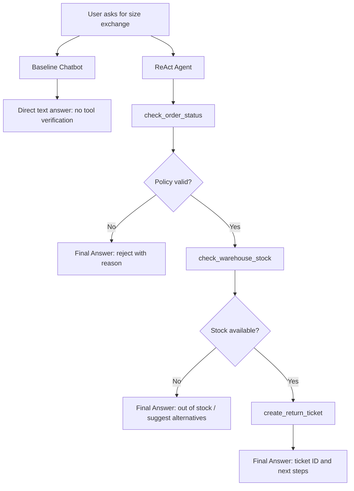

# Group Report: Lab 3 - Retail Return ReAct Agent

- **Team Name**: 087
- **Team Members**: Đào Xuân Bách (2A202600640), Nguyễn Công Thành (2A202600696)
- **Deployment / Evaluation Date**: 2026-06-01
- **Domain**: Fashion retail size exchange / return support

---

## 1. Executive Summary

Nhóm xây dựng một hệ thống hỗ trợ đổi size cho shop thời trang và dùng lab này để so sánh rõ hai hướng tiếp cận:

- **Chatbot baseline**: trả lời trực tiếp bằng ngôn ngữ tự nhiên, không có quyền gọi tool.
- **ReAct Agent v1/v2**: dùng vòng lặp `Thought -> Action -> Observation -> Final Answer` để kiểm tra đơn hàng, kiểm tra tồn kho và tạo phiếu đổi hàng khi đủ điều kiện.

Kết quả offline evaluation ngày 2026-06-01:

| System | Passed / Total | Success Rate | Avg Latency | Total Tokens | Est. Cost | Avg Loop | Parser / Tool / Timeout Errors |
| :--- | ---: | ---: | ---: | ---: | ---: | ---: | :--- |
| Chatbot baseline | 0 / 5 | 0.0% | 0.0ms | 327 | $0.003270 | 1.00 | 0 / 0 / 0 |
| Agent v1 | 5 / 5 | 100.0% | 0.8ms | 4133 | $0.041330 | 2.60 | 0 / 0 / 0 |
| Agent v2 | 5 / 5 | 100.0% | 0.2ms | 5504 | $0.055040 | 2.60 | 0 / 0 / 0 |

**Main finding**: Chatbot baseline có câu trả lời thân thiện nhưng không thể chứng minh nghiệp vụ vì không gọi được tool. ReAct Agent đạt 100% trên 5 test cases vì mỗi quyết định quan trọng đều được kiểm chứng bằng `Observation` từ tool.

**Important trade-off**: Agent v2 không tăng success rate so với v1 trên bộ test nhỏ vì v1 đã đạt 100%, nhưng v2 tốt hơn về guardrail: không tạo ticket nếu chưa có `policy_valid=true` và stock `available`. Đổi lại, v2 dùng nhiều token hơn v1.

---

## 2. Rubric Coverage Summary

| Scoring Category | Evidence in Submission | Status |
| :--- | :--- | :--- |
| Chatbot Baseline | `src/chatbot.py`, evaluation logs `logs/chatbot_baseline.jsonl`, 0/5 result explained. | Covered |
| Agent v1 Working | `src/agent/agent.py`, `src/agent/prompts.py`, `ScriptedRetailReActProvider`, 3 retail tools. | Covered |
| Agent v2 Improved | v2 prompt adds explicit safety rules before ticket creation. | Covered |
| Tool Design Evolution | Tools documented from policy check -> stock check -> ticket creation. | Covered |
| Trace Quality | Successful trace TC01 and failure/negative trace TC03 included below. | Covered |
| Evaluation & Analysis | Comparison table includes success rate, latency, token count, cost, loop count, errors. | Covered |
| Flowchart & Insight | Mermaid flowchart and group learning points included. | Covered |
| Code Quality | Modular provider layer, tools layer, telemetry, tests, Streamlit demo. | Covered |
| Bonus: Extra Monitoring | Cost estimate, token count, loop count, parser/tool/timeout errors, missing expected tools. | Covered |
| Bonus: Failure Handling | `max_steps`, parser error logging, tool error logging, v2 guardrails. | Covered |
| Bonus: Ablation | v1 vs v2 prompt comparison and chatbot vs agent comparison. | Covered |
| Bonus: Live Demo | Streamlit app exists, but live demo completion cannot be proven from repository files. | Missing proof |
| Bonus: Extra Tools | No browsing/search/external advanced tool beyond retail workflow tools. | Not covered |

---

## 3. System Architecture

### 3.1 Main Components

| Layer | File(s) | Responsibility |
| :--- | :--- | :--- |
| Baseline chatbot | `src/chatbot.py` | Produces direct natural-language answer without tool calls. |
| Agent loop | `src/agent/agent.py` | Parses LLM output, calls tools, records observations, stops on final answer or max steps. |
| Agent prompts | `src/agent/prompts.py` | Defines ReAct format and v1/v2 behavior. |
| Provider layer | `src/core/*.py`, `src/agent/run_agent.py` | Supports OpenAI, Gemini, local model, and offline scripted provider. |
| Retail tools | `src/tools/retail_tools.py` | Checks order policy, checks warehouse stock, creates return/exchange ticket. |
| Telemetry | `src/telemetry/*.py`, `logs/` | Captures events, token usage, latency, loop count, cost, and error codes. |
| Evaluation | `src/evaluate.py`, `src/analyze_logs.py` | Runs test cases and aggregates metrics. |
| Demo UI | `streamlit_app.py` | Shows chatbot vs agent comparison, traces, metrics, and saved logs. |
| Tests | `tests/test_retail_workflow.py`, `tests/test_local.py` | Verifies tool behavior, parser behavior, evaluation logic, and workflows. |

### 3.2 ReAct Loop

The agent expects the LLM to produce either:

```text
Thought: ...
Action: tool_name({"key": "value"})
```

or:

```text
Final Answer: ...
```

Execution flow:

1. User query is sent to the agent with tool descriptions and ReAct instructions.
2. LLM returns an `Action` or `Final Answer`.
3. If an `Action` exists, the agent parses JSON arguments.
4. The matching Python tool is executed.
5. Tool output is appended as an `Observation`.
6. The loop continues until `Final Answer` or `max_steps`.

### 3.3 Flowchart



---

## 4. Tool Design Evolution

### Stage 1: Minimal Chatbot Baseline

Baseline chatbot only receives the user message and returns text. It is useful as a comparison point, but cannot verify:

- whether the order exists,
- whether the order is within the 7-day exchange window,
- whether the item is final sale,
- whether the target size is in stock,
- whether a ticket was actually created.

### Stage 2: Agent v1 with Retail Tools

Agent v1 adds three concrete tools:

| Tool | Input | Output / Purpose |
| :--- | :--- | :--- |
| `check_order_status` | `customer_id`, `product_id` | Returns order ID, delivery date, current size, `policy_valid`, and reason. |
| `check_warehouse_stock` | `product_id`, `size` | Returns stock status, quantity, and warehouse. |
| `create_return_ticket` | `order_id`, `action_type`, `detail` | Creates an exchange/return ticket and returns ticket information. |

### Stage 3: Agent v2 with Guardrails

Agent v2 keeps the same tools but improves the prompt discipline:

- must call `check_order_status` before any ticket creation,
- must stop if `policy_valid=false`,
- must call `check_warehouse_stock` before exchange ticket creation,
- must stop if stock is `out_of_stock`,
- must create ticket only after both policy and stock are verified.

This addresses a production risk: a model may create a ticket too early if the prompt does not explicitly bind final actions to tool observations.

---

## 5. Evaluation Metrics & Analysis

Evaluation command:

```bash
python3 -m src.evaluate --offline-agents
python3 -m src.analyze_logs
```

### 5.1 Aggregate Reliability

| System | Success Rate | Failure Types |
| :--- | ---: | :--- |
| Chatbot baseline | 0.0% | `ticket_not_created`: 1, `missing_expected_tools`: 4 |
| Agent v1 | 100.0% | None |
| Agent v2 | 100.0% | None |

The key evaluation improvement is that a case only passes when:

1. the final outcome matches the expected outcome,
2. all required tools were called,
3. the expected tool sequence is respected.

This prevents "false pass" cases where a negative scenario passes only because no ticket was created, even though the agent skipped a required verification step.

### 5.2 Token Efficiency and Cost

| System | Total Tokens | Estimated Cost | Interpretation |
| :--- | ---: | ---: | :--- |
| Chatbot baseline | 327 | $0.003270 | Cheapest, but unreliable for workflow tasks. |
| Agent v1 | 4133 | $0.041330 | More expensive because it performs multi-step reasoning and tool calls. |
| Agent v2 | 5504 | $0.055040 | Most expensive due to longer safety prompt, but strongest guardrail behavior. |

Insight: Token cost increases substantially when moving from chatbot to ReAct Agent. This is acceptable only if the business task requires verified actions. For FAQ-only tasks, baseline may be enough; for exchange/refund workflows, tool-verified agent behavior is worth the extra cost.

### 5.3 Latency

| System | Average Latency |
| :--- | ---: |
| Chatbot baseline | 0.0ms |
| Agent v1 | 0.8ms |
| Agent v2 | 0.2ms |

These numbers come from the offline scripted provider, so they prove instrumentation works but do not represent real network LLM latency. In production, total duration would include all LLM calls plus tool execution time.

### 5.4 Loop Count and Termination

| System | Average Loop Count | Termination Quality |
| :--- | ---: | :--- |
| Chatbot baseline | 1.00 | Single response, no tool loop. |
| Agent v1 | 2.60 | Terminates correctly on all 5 cases. |
| Agent v2 | 2.60 | Same loop count with stricter stopping rules. |

No timeout was observed. The agent also has `max_steps` protection to prevent endless loops.

### 5.5 Error Codes

| Error Type | Chatbot | Agent v1 | Agent v2 |
| :--- | ---: | ---: | ---: |
| JSON parser error | 0 | 0 | 0 |
| Tool error | 0 | 0 | 0 |
| Timeout / max steps | 0 | 0 | 0 |
| Missing expected tools | 4 cases | 0 | 0 |

The most important failure signal is `missing_expected_tools` for the baseline. It shows that surface-level text quality is not enough for this lab; the system must prove the right reasoning path through tools.

---

## 6. Trace Quality

### 6.1 Successful Trace: TC01 - Valid Size Exchange

**User intent**: Customer wants to exchange product `AT102` from size M to size L.

Expected path:

```text
check_order_status -> check_warehouse_stock -> create_return_ticket
```

Agent trace:

| Step | Action / Observation |
| :--- | :--- |
| 1 | `check_order_status({"customer_id": "USER_48291", "product_id": "AT102"})` |
| Observation | `policy_valid=true`, order `DH-99214`, reason `Within 7-day exchange window` |
| 2 | `check_warehouse_stock({"product_id": "AT102", "size": "L"})` |
| Observation | `status="available"`, `stock_quantity=14` |
| 3 | `create_return_ticket({"order_id": "DH-99214", "action_type": "EXCHANGE", ...})` |
| Observation | ticket `TK-8831`, process time `2-3 ngày` |
| Final | Agent confirms the exchange ticket and next steps. |

Why this is correct: The agent creates a ticket only after both policy and stock are verified.

### 6.2 Negative / Failure-Prevention Trace: TC03 - Out of Stock Size L

**User intent**: Customer wants to exchange product `AT104` from size M to size L.

Expected path:

```text
check_order_status -> check_warehouse_stock
```

Agent trace:

| Step | Action / Observation |
| :--- | :--- |
| 1 | `check_order_status({"customer_id": "USER_48291", "product_id": "AT104"})` |
| Observation | `policy_valid=true`, order `DH-66304`, reason `Within 7-day exchange window` |
| 2 | `check_warehouse_stock({"product_id": "AT104", "size": "L"})` |
| Observation | `status="out_of_stock"`, `stock_quantity=0` |
| Final | Agent says size L is unavailable and does not create a ticket. |

Why this matters: TC03 is designed so the order is valid but stock is unavailable. This isolates stock-checking behavior. A system that simply refuses without checking warehouse stock should fail this case.

---

## 7. Ablation Experiments

### 7.1 Chatbot vs ReAct Agent

| Case | Chatbot Baseline | ReAct Agent |
| :--- | :--- | :--- |
| TC01 valid exchange | Fails because no ticket is created. | Checks policy, checks stock, creates ticket. |
| TC02 expired window | Does not verify policy by tool. | Checks order and rejects due to expired 7-day window. |
| TC03 out of stock | Does not verify stock. | Checks policy, checks stock, refuses ticket because stock is 0. |
| TC04 order not found | Does not verify order existence. | Calls order tool and asks for more information. |
| TC05 final sale | Does not verify final sale policy. | Calls order tool and rejects due to final sale. |

Conclusion: For this workflow, ReAct Agent is better because success depends on external state, not just language quality.

### 7.2 Agent v1 vs Agent v2

| Version | Result | Strength | Weakness |
| :--- | :--- | :--- | :--- |
| Agent v1 | 5/5 pass, 4133 tokens | Shorter prompt and lower token cost. | Less explicit safety discipline in prompt. |
| Agent v2 | 5/5 pass, 5504 tokens | Stronger guardrails before ticket creation. | Higher token cost. |

Conclusion: v2 should be preferred for production-style workflows where a wrong ticket/refund action is more costly than extra tokens.

---

## 8. Code Quality and Monitoring

The codebase is organized into clear modules:

- `LLMProvider` abstraction supports OpenAI, Gemini, local, and offline scripted providers.
- Retail tools are isolated from the agent loop.
- Evaluation logic is separated from the Streamlit UI.
- Telemetry records LLM metrics, tool calls, observations, parser errors, tool errors, timeouts, and cost estimates.
- Tests verify core behavior.

Verification:

```text
python3 -m pytest -q
9 passed, 24 warnings
```

Known warning:

- `datetime.utcnow()` in `src/telemetry/logger.py` is deprecated. It should be replaced with timezone-aware UTC timestamps for production.

---

## 9. Production Readiness

Current system is a strong lab prototype, but production deployment would require:

- authentication and authorization before creating tickets,
- unique ticket IDs instead of fixed demo ID `TK-8831`,
- idempotency key to prevent duplicate ticket creation during retry,
- real database integration instead of JSON mock data,
- real model pricing by provider/model,
- P50/P95/P99 latency dashboard,
- alerting for parser errors, hallucinated tools, tool errors, timeout spikes, and missing expected tool patterns,
- RAG over official return policy documents,
- human approval for high-risk refund or compensation actions.

---

## 10. Missing Items Against Scoring Metrics

The report and repository cover the required base scoring categories. The remaining gaps are mostly metadata or bonus evidence:

| Missing / Weak Item | Why It Matters | Suggested Fix |
| :--- | :--- | :--- |
| Team name and team member list are placeholders. | Required for submission identity. | Fill in `Team Name` and `Team Members`. |
| Live demo evidence is not in the repo. | Bonus category gives up to +5. | Add screenshot, instructor sign-off note, or demo date result if completed. |
| No advanced external tools such as browsing/search. | Bonus category gives up to +2. | Only add if relevant; current retail tools are enough for base score. |
| Offline latency is not real production latency. | Rubric asks industry metrics; offline scripted numbers are only instrumentation proof. | Add one run with OpenAI/Gemini/local model if API/model is available. |
| Fixed ticket ID `TK-8831`. | Fine for lab, not production-safe. | Generate unique IDs and add idempotency in future improvement. |

